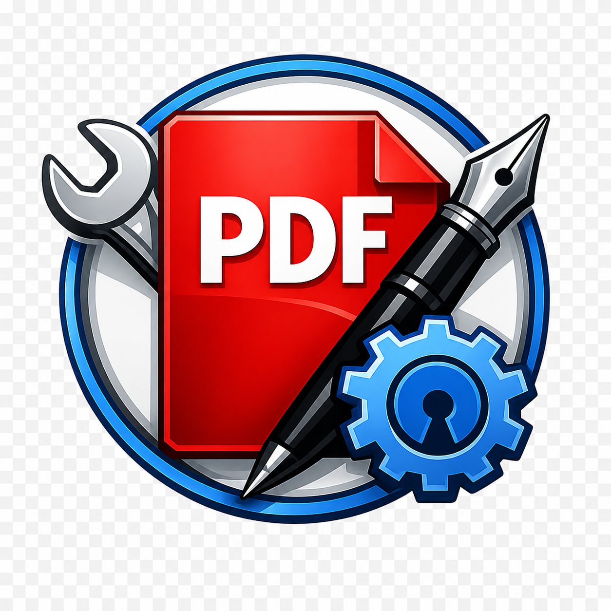

<p align="center">
  
</p>

<h1 align="center">FreePDF Suite</h1>

<p align="center">Free and open source PDF reader for Windows</p>

<p align="center">
  
  
  
</p>

---

FreePDF Suite is a lightweight desktop PDF reader built with Python and Qt6. It opens standard PDFs and signed P7M files, renders pages on demand, and ships with search, thumbnails, and multi-language UI.

## Features

- PDF and P7M reading (signed Italian electronic documents)
- Lazy page rendering for smooth scrolling on large files
- In-document text search with match navigation
- Page thumbnail sidebar
- UI in English, Italian, French, German, Spanish, and Portuguese
- Portable Windows build via PyInstaller

## Getting Started

Requires Python **3.11+** and [Poetry](https://python-poetry.org/).

```bash
poetry install
poetry run python -m ui
```

Run the test suite:

```bash
poetry run pytest
```

## Building the portable exe

```bash
poetry run python scripts/build.py
```

The executable is written to `dist/`.

## Project layout

| Folder | Purpose |
| --- | --- |
| `core/` | PDF engine (PyMuPDF), format handlers |
| `ui/` | Qt6 application shell, dialogs, styling |
| `config/` | Default settings |
| `tests/` | Pytest suite |
| `scripts/` | Build and developer utilities |

## License

Released under the [MIT License](LICENSE).
