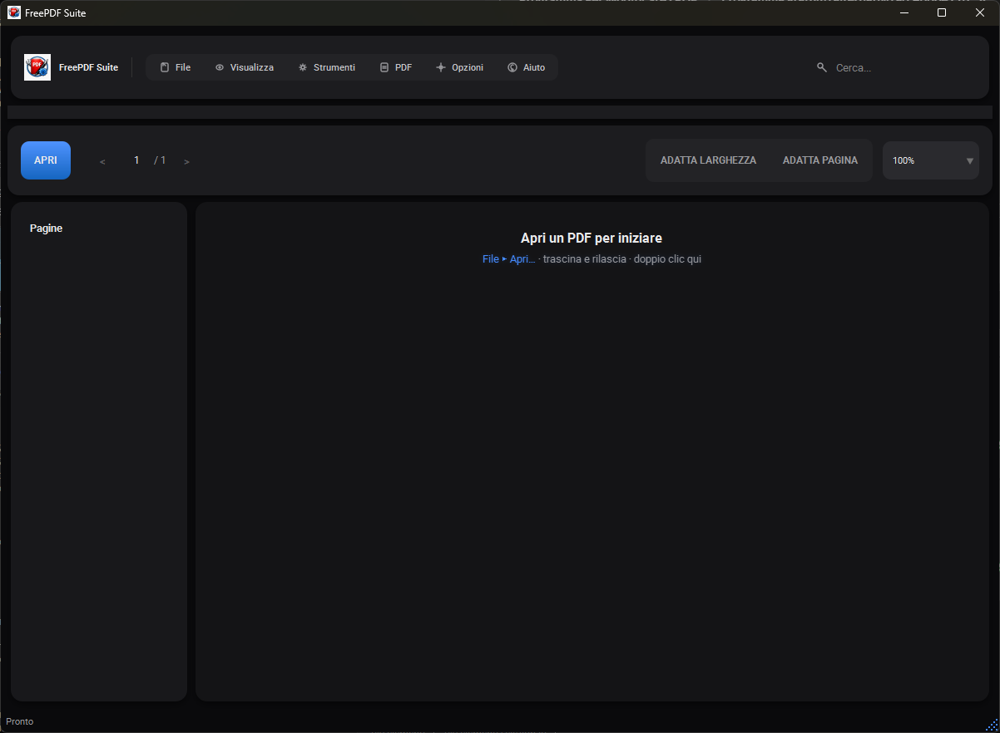
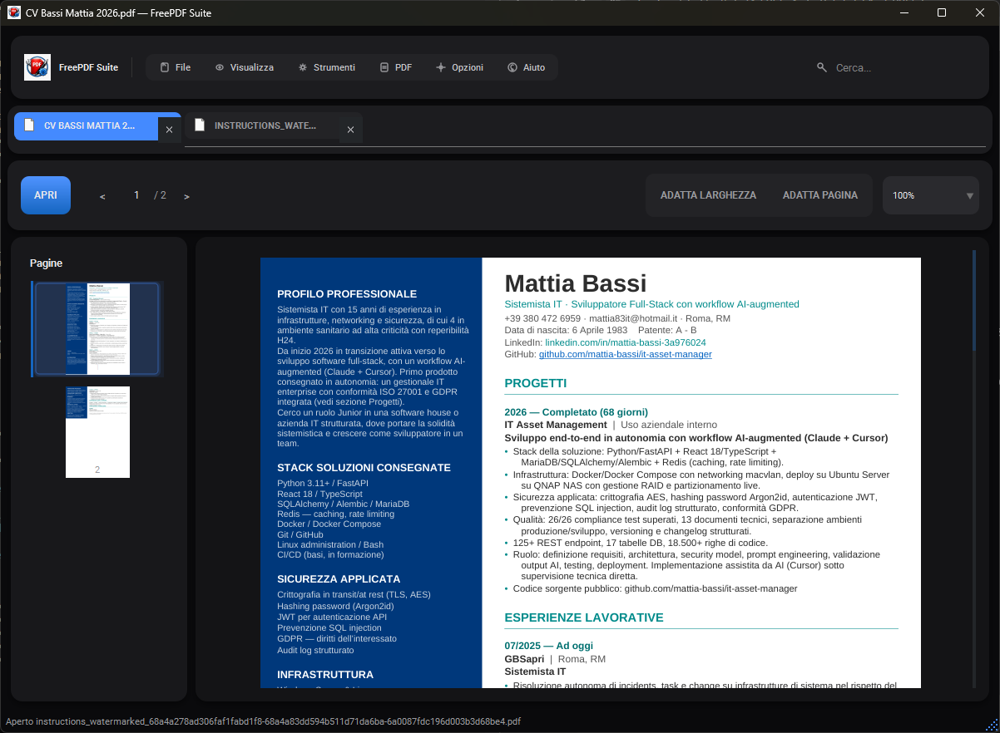
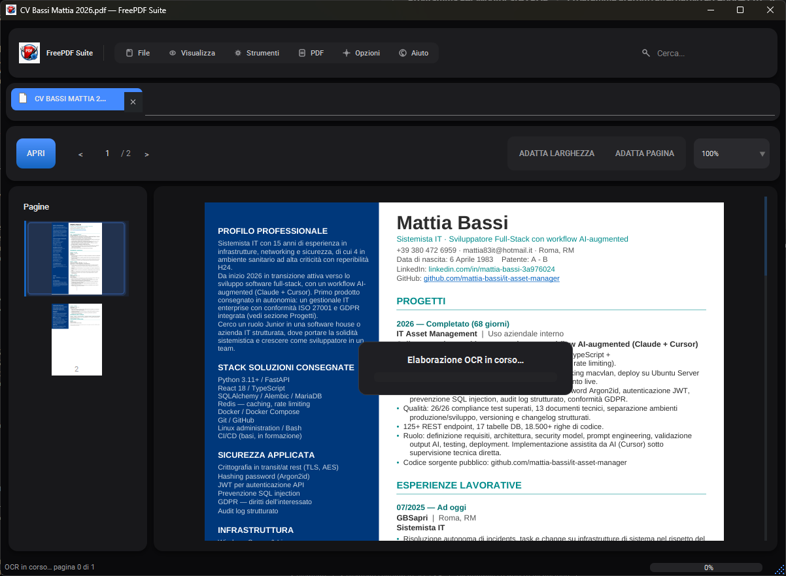
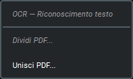

<div align="center">
  
  <h1>FreePDF Suite</h1>
  <p>Free and open source PDF reader and editor for Windows</p>
  <p>
    
    
    
    
    
  </p>
</div>

---

FreePDF Suite is a free, open source alternative to Adobe Acrobat Pro for Windows. 
Built with Python, PySide6 (Qt6) and PyMuPDF, it delivers a modern dark-theme 
interface with professional features — zero cost, zero ads, zero subscriptions.



## Features

### Core Reader
- Open **PDF** (1.0–2.0), **PDF/A**, **PDF/X**, and **P7M** 
  (Italian signed documents) with automatic format detection
- Lazy page rendering — instant first page, smooth scrolling on large files
- Full-text search with highlighted matches and Ctrl+F
- Page thumbnail sidebar with click-to-navigate
- Zoom from 10% to 400%, Ctrl+Scroll, Fit Width / Fit Page toggle
- Password-protected PDF support
- Drag & drop file opening

### Multi-Tab Viewer
Open multiple documents simultaneously — each tab preserves its own 
page position, zoom level and scroll state independently.



### OCR — Text Recognition
One-click OCR powered by Tesseract (bundled, no installation required).
Converts scanned PDFs to searchable documents — select and copy any text 
after processing.



### Page Manager
Full page manipulation without leaving the app:
- **Reorder** pages via drag & drop in the thumbnail panel
- **Rotate, delete, insert** pages via right-click context menu
- **Split PDF** — visual interface with clickable ✂ split points between pages
- **Merge PDFs** — combine multiple files in any order



### Text Selection & Copy
Click and drag to select text in any PDF — native or OCR'd.
Column-aware selection (k-means clustering) prevents bleeding 
across multi-column layouts. Ctrl+C to copy to clipboard.

### Settings & Localization
Full Options dialog (General, View, PDF, Advanced) with persistence.
Interface available in **English, Italian, French, German, Spanish, Portuguese**.

## Getting Started

### Requirements
- Windows 10 or later
- Python 3.12+ and [Poetry](https://python-poetry.org/)

### Run from source
```bash
git clone https://github.com/mattia-bassi/freepdf-suite.git
cd freepdf-suite
poetry install
poetry run python -m ui
```

### Build portable .exe
```bash
poetry run python scripts/build.py
```
Output in `dist/FreePDFSuite/FreePDFSuite.exe` — copy the folder anywhere, 
no installation required.

> **Note:** OCR requires Tesseract binaries in the `tesseract/` folder.
> See [docs/TESSERACT_SETUP.md](docs/TESSERACT_SETUP.md) for setup instructions.

### Run tests
```bash
poetry run pytest -q
# 62 passed
```

## Project Structure

| Folder | Purpose |
|--------|---------|
| `core/` | PDF engine, OCR, page manager, text selection |
| `ui/` | Qt6 interface, dialogs, theming, i18n |
| `tests/` | Pytest suite (62 tests) |
| `scripts/` | PyInstaller build script |
| `config/` | Default settings |
| `assets/` | Logo and icons |
| `docs/` | Documentation and screenshots |

## Tech Stack

| Component | Technology |
|-----------|-----------|
| Language | Python 3.12 |
| UI Framework | PySide6 (Qt6) |
| PDF Engine | PyMuPDF (MuPDF) |
| OCR | Tesseract 5 + pytesseract |
| Theme | qt-material (dark blue) |
| Build | PyInstaller |
| Tests | pytest |
| Dependencies | Poetry |

## Roadmap

- [ ] MOD-04 Text Editor — edit existing text, add text boxes
- [ ] MOD-02 Annotations — highlights, notes, stamps
- [ ] MOD-07 Conversions — PDF to Word/Excel/images
- [ ] MOD-08 Security — passwords, redaction, watermarks
- [ ] MOD-06 Form Creator — fillable PDF forms

## Contributing

Contributions are welcome. Please open an issue before submitting a PR.

## License

Released under the [MIT License](LICENSE) — free forever.

---

<div align="center">
  Built with Python + AI-augmented workflow (Claude + Cursor)
</div>
